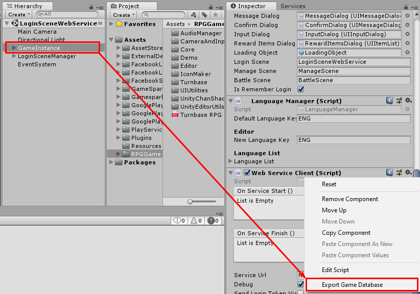
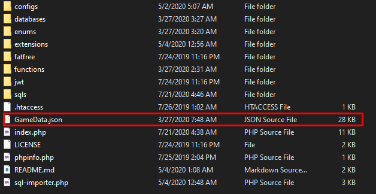

# tbrpg-php-service
PHP web-service for RPG project

## How to setup
* Set config in `./configs/config.ini`
* `db_prefix` is table name prefix, if you set this to "rpg_" your table name will be like "rpg_player"
* `db_host` database server address
* `db_port` database server port
* `db_name` database name
* `db_user` database username
* `db_pass` database password
* Then browse `sql-importer.php` from web-browser, if you see `Done ;)` with no errors, that is done the web-service is ready to use. (To Browse `sql-importer.php` I means to open your web-browser (Google Chrome, Microsoft Edge, Apple Safari or something)
to open your web where you placed website scripts. for example, if I placed scripts to `./htdocs/service` I have to open my web by the URL like as : `https://www.mywebsite.com/service/sql-importer.php` to import tables to database)
* You should remove `sql-importer.php` after imported

## How to update
* Browse `sql-importer.php?update={{version}}`, for example `sql-importer.php?update=1.10`

## Extension system
You can extract an extension to `./extensions` folder
If extension is required extra database table, you can browse `sql-importer.php?extension={{extension-name}}&version={{version}}` to import.

## Client-side implemented project
* [rpg-web-service-client](https://github.com/insthync/rpg-web-service-client) - Client for project [Turnbase RPG Template](https://assetstore.unity.com/packages/templates/systems/turnbase-rpg-template-107578) which selling at Unity Asset Store.

### How to export game data from Unity project

**I might make implement for UNREAL blueprint project later :)**
